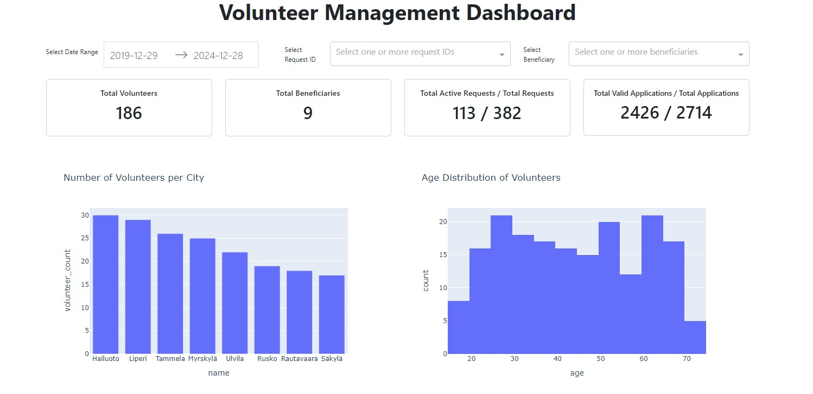
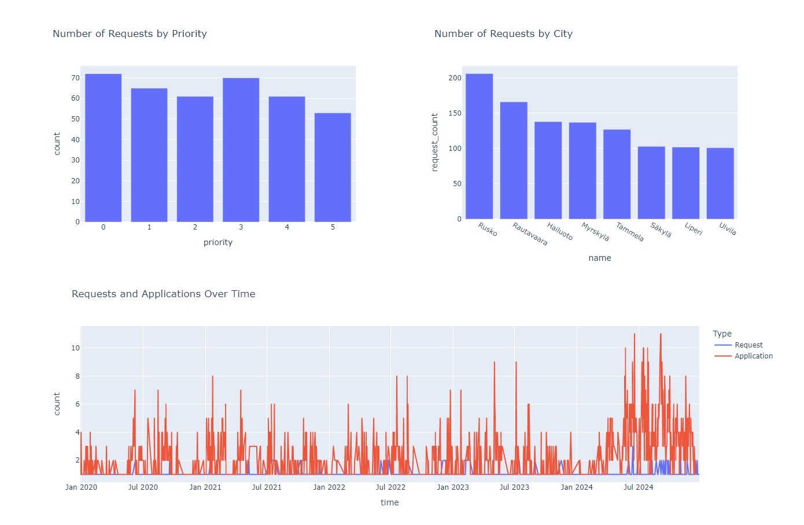
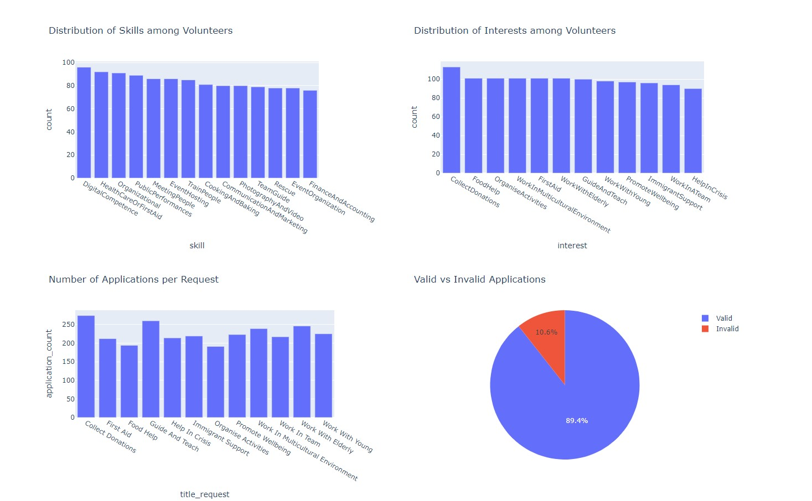

# Databases for Data Science (CS-A1155)

Aalto University · 5 ECTS · Spring 2024 · Group project · Grade: 5 (Excellent)

End-to-end database project: relational schema design and table creation (PostgreSQL), data insertion, views, triggers, and transactions (`code/`), topped with an interactive Dash dashboard (`final_deliverable/`). Project reports are in `doc/`.

**Tools:** PostgreSQL, SQL, Python (psycopg2, Dash/Plotly)

---

# Databases Group 12 - Interactive Volunteer Management Dashboard

## Authors and acknowledgment
Anh Pham

## Introduction

The Volunteer Management Dashboard is designed to provide an interactive and comprehensive view of volunteer activities, requests, and applications. This dashboard helps administrators and stakeholders to monitor and analyse volunteer engagement, request fulfilment, application trends, etc.

## Visuals
To help you get started, here are some visuals of the dashboard:<br />
- **Date Range Picker:** Easily filter data based on specific date ranges.<br />
- **Request ID Picker:** Easily filter data based on specific request ID(s).<br />
- **Beneficiary Picker:** Easily filter data based on specific beneficiaries.<br />
- **Overview Metrics:** Quick insights into key metrics like total volunteers, total beneficiaries, active requests, and valid applications.<br />
- **Graphs and Charts:** Detailed visualizations such as volunteers by city, age distribution, requests by priority, and more.<br />
### Dashboard Overview
<br />
<br />
<br />

## Installation instructions
Installation instructions:<br />
Download the repository and open it in your environment<br />
Run the following commands to activate a virtual environment, install the requirements and run the program. (You can also try to install the requirement manually)
```
python -m venv venv
.\venv\Scripts\Activate  # For Windows
# source venv/bin/activate  # For macOS/Linux
pip install -r requirements.txt
python final_deliverable/app.py
```

## User instructions

- Run the dashboard according to the Installation instructions.
- Open http://127.0.0.1:8050/ on your web browser.
- Filter the date range (if preferred).
- Filter the request ID(s) (if preferred).
- Filter the beneficiaries (if preferred).
- For all the filters, you should be able to type what you preferred in the boxes or you can select manually on the calendar (Date filter) or the dropboxes (Request IDs and Beneficiaries filters).
- For graphs/charts that display multiple variables, you can filter by double-clicking the name of the variable in the legend. Double-click again to reset the filter.

## Overview of the Dashboard
**1. Filter options:<br />**
Allows users to filter data based on a selected date range, request ID(s), or beneficiaries. The filters are easily accessible and integrated with other filters to provide a dynamic view of the data.

**2. Overview Metrics:<br />**
Displays key metrics including:<br />
**Total Volunteers:** The total number of volunteers.<br />
**Total Beneficiaries:** The total number of beneficiaries.<br />
**Total Active Requests / Total Requests:** The number of currently active requests (those requests with End date >= Today) compared to the total number of requests.<br />
**Total Valid Applications / Total Applications:** The number of valid applications compared to the total number of applications.

**3. Graphs and Charts:<br />**
**Volunteers by City:<br />**
Shows the distribution of volunteers across different cities, providing insights into regional engagement levels.<br />
**Age Distribution of Volunteers:<br />**
Provides an age-wise distribution of volunteers, helping to understand the demographics of volunteer participants.<br />
**Requests by Priority:<br />**
Displays the number of requests categorized by their priority levels, highlighting areas of urgent need.<br />
**Age Distribution of Volunteers:<br />**
Provides an age-wise distribution of volunteers, helping to understand the demographics of volunteer participants.<br />
**Requests by City:<br />**
Shows the number of requests in each city, offering a geographical perspective on demand for volunteer services.<br />
**Requests and Applications Over Time:<br />**
Compares the trends of requests and applications over time, illustrating seasonal or temporal patterns in volunteer activities.<br />
**Skills Distribution:<br />**
Visualizes the distribution of skills among volunteers, helping to identify areas of strength and potential gaps.<br />
**Interests Distribution:<br />**
Illustrates the various interests of volunteers, aiding in the matching of volunteers to suitable tasks and requests.<br />
**Applications per Request:<br />**
ows the number of applications received for each request title, providing insights into volunteer interest and engagement for specific activities.<br />
**Valid and Invalid Applications:<br />**
Displays a pie chart differentiating valid and invalid applications, helping to assess the quality and relevance of applications.<br />